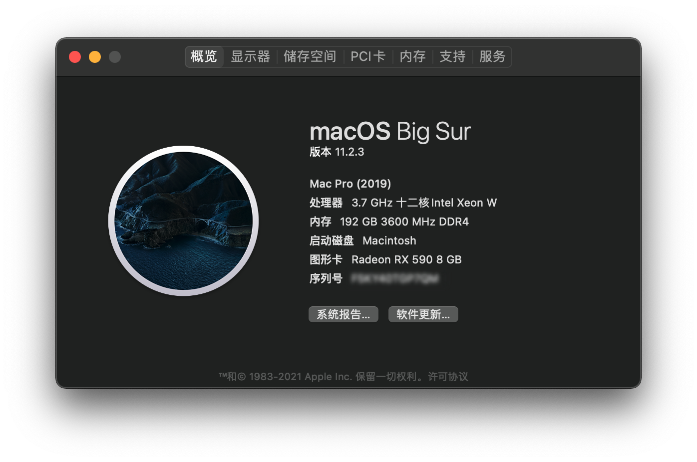

[English](./README_EN.md) | 简体中文

# Ryzen 安装 hackintosh 的 OpenCore EFI 文件

OpenCore 版本：v0.6.8

macOS 版本：Big Sur(11.2.3)

## 规格参数

| 类型     | 型号                                                     |
| -------- | -------------------------------------------------------- |
| 处理器   | AMD 锐龙 9 5900X 12 核 @ 3.7GHz                          |
| 主板     | 华硕 ROG Strix X570-E Gaming                             |
| 显卡     | 蓝宝石 Radeon RX 590 超白金 8G G5                        |
| 内存     | 32 GB (16GB × 2) 美商海盗船复仇者 RGB Pro DDR4 @ 3200MHz |
| 固态硬盘 | 1TB 西数黑盘 SN750, 500GB 三星 860 EVO SATA              |
| 无线网卡 | 板载 Intel AX200                                         |
| 有线网卡 | 板载 Intel I211-AT 1G, 板载 Realtek RTL8125-CG 2.5G      |

## 安装步骤

1. 制作 [macOS 启动盘](https://dortania.github.io/OpenCore-Install-Guide/installer-guide/mac-install.html#downloading-macos-modern-os)
2. 为你的`config.plist`使用 [GenSMBIOS](https://github.com/corpnewt/GenSMBIOS) 生成 SMBIOS 信息
3. 根据 [Dortania's OpenCore Big Sur 安装指引](https://dortania.github.io/OpenCore-Install-Guide/extras/big-sur/#table-of-contents) 进行安装

## 可用

- 板载 WIFI，板载蓝牙*，板载有线网口（2.5G和1G）
- iMessage，iCloud，FaceTime，App Store，Apple Music
- 接力，AirPlay
- 所有 USB 接口
- 睡眠、唤醒

\* 有时候从长时间睡眠中唤醒后无法使用

## 不可用

- 隔空投送，Sidecar
- 使用您的 Apple Watch 解锁 App 和 Mac

\* 隔空投送，Sidecar，Apple Watch 解锁 Mac 需要加装博通芯片网卡，即可正常使用

## FAQ

### 问：Docker 显示 "it's not compatible with this architecture" 或 VMware Fusion/Parallel Desktop 无法运行

答：Docker, VMware Fusion, Parallel Destop 等虚拟化软件均基于 Apple Hypervisor Kit 构建，而 Apple Hypervisor Kit 使用了 Intel VT-x Virtualization Technology, 需要虚拟化支持可以考虑安装 VirtualBox。

### 问：Adobe 全家桶和 Luminar 等应用程序崩溃

答：此类软件的共同点是使用了部分 Intel 特有的指令如 ***intel_fast_memset*** 等，这些指令无法正常地被 AMD 处理器执行从而导致崩溃，解决方法可以参考 [AdobeAMDFix.md](https://gist.github.com/naveenkrdy/26760ac5135deed6d0bb8902f6ceb6bd)

